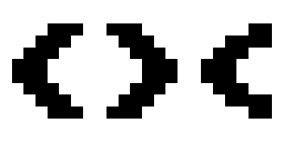

<h1 align="center">
    
     
    Fishing Enterprises
</h1>
<h4 align="center">
    An incremental fishing game developed by Joshua Sperry
</h4>

    <a href="https://twitter.com/FishEnterprises">Twitter</a> |
    <a href="https://www.paypal.me/fishingenterprises">Paypal</a> |
    <a href="https://www.patreon.com/fishingenterprises">Patreon</a>

## How to Play
Fishing Enterprises was developed for desktops and has cross-browser compatibility. Currently there is no mobile testing or support, but it may be possible to play anyway. [You can play the game here](https://mrsperry.github.io/fish/fish.html).

Feel free to download this repository and play offline as well.

## About the Game
I started creating Fishing Enterprises in late October, 2018. The original idea was inspired by [Universal Paperclips](http://www.decisionproblem.com/paperclips/), [A Dark Room](http://adarkroom.doublespeakgames.com/) and [Candy Box 2](https://candybox2.github.io/).

The game is split into 'sections' with slight paradigm shifts during the transitions from one section to the next. My goal is to have each section unique with minor references to previous sections.

#### Gameplay
Currently you start out as an insignificant fisherman catching a range of fish in common areas. As you progress you spend your money on upgrades and boat parts that will allow you to fish out at sea. Later areas, specifically in the ocean, have more valuable fish that you can use to eventually start your own business.

Once you have purchased the shop you are immediately granted a new set of features. These include being able to read the news and worker allocation. Worker allocation allows the collection of fish automatically without the need for bait and tackle. The news broadcasts important information on area availability and some (hopefully) witty stories.

After you have earned enough money, you receive the option to diversify your business and turn it into an enterprise. This section of the game is currently a work in progress.

## Contributing
I allow and appreciate issues, however I'm currently not accepting any pull requests as I'm frequently changing files and may already have fixed the issue. Eventually I may accept pull requests and add a license but that is not certain.

## Support Me
I regularly post [screenshots on Twitter](https://twitter.com/FishEnterprises).

[Donate via Paypal](https://www.paypal.me/fishingenterprises) or [pledge with Patreon](https://www.patreon.com/fishingenterprises).

Or send me some kind words at mrjoshuasperry@gmail.com

## License
All of my work is currently unlicensed.

    <>< <>< <><

